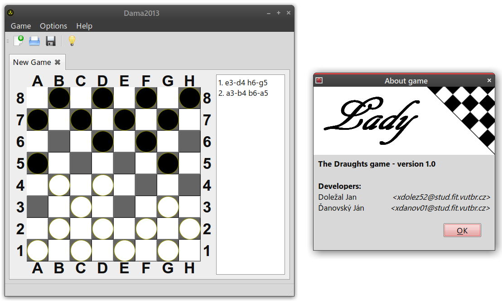

# Lady_game
The Draughts game

school project on Brno University of Technology in year 2013, C++ subject

# Authors
- Doležal Jan
- Ďanovský Ján

# Requirements
- Qt 4.7 or newer

# Name
Why "Lady game"? Because the are same word "dáma" for "lady" and "Draughts" in our languages (slovak and czech)
